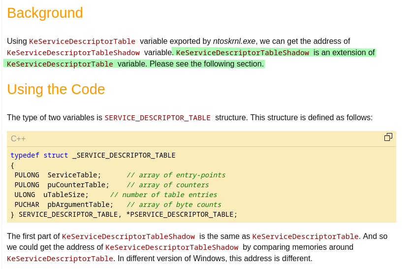
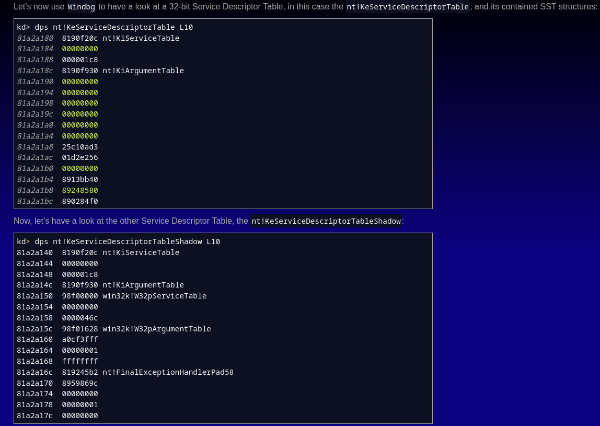
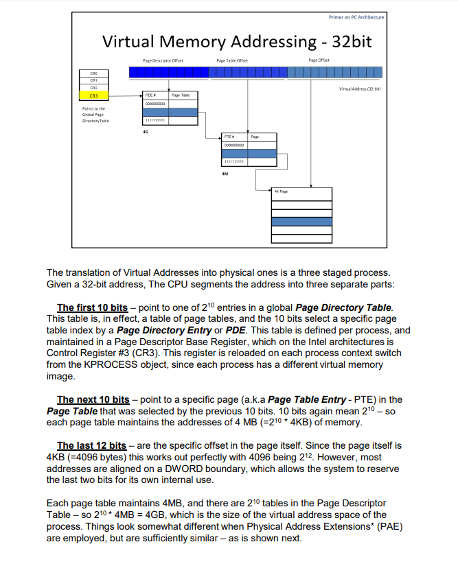

# Kernel SSDT hooking
When calling the system call routine, the system call number is stored in the eax register, which is 32-bit value. But how is that number then used? It can't be an index into a table of pointers, because if 32-bits were used as an index, it would mean the table is 4GB large, which is certainly not so. With a little bit of research we can find our that the system service number is broken up unto three parts:

    bits 0-11: the system service number (SSN) to be invoked.
    bits 12-13: the service descriptor table (SDT).
    bits 14-31: not used.

Only the lower 12-bits are used as an index into the table, which means the table is **4096 bytes in size**. The upper 18-bits are not used and the middle 2-bits are used to select the appropriate service descriptor table – therefore we can have a maximum of **4 system descriptor tables (SDT)**. In Windows operating systems, **only two tables are used and they are called KeServiceDescriptorTable (middle bits set to 0x00) and KeServiceDescriptorTableShadow (middle bits set to 0x01)**.

Note that the KeServiceDescriptorTable is exported by the **ntoskrnl.exe**, while the KeServiceDescriptorTableShadow is not exported. Both Service Descriptor Tables (SDTs) contain a structure called System Service Table (SST), which have a structure like presented below.

The Service Descriptor Table Number (SDTN) points to one of the 4 SDT tables, where only the first two are actually used and point to the SST. The KeServiceDescriptorTable points to one SST, which further points to the SSDT table. The KeServiceDescriptorTableShadow points to two SSTs where the first one points to the same SSDT table and the second one point to a secondary SSDT table.

The following picture shows the contents of KeServiceDescriptorTable as well as KeServiceDescriptorTableShadow while using windbg:

We can see that KeServiceDescriptorTableShadow contain service table for **Windows Native APIs exported by ntoskrnl.exe** and the second one **describes the SSDT for the User and GDI routines exported by win32k.sys**

Sources:

- https://www.codeproject.com/Articles/26368/How-Can-I-Get-the-Address-of-KeServiceDescriptorTa
- https://www.infosecinstitute.com/resources/hacking/hooking-system-service-dispatch-table-ssdt/
- http://www.atelierweb.com/index.php/the-quest-for-the-ssdts/

# Windows global page directory

In order for drakvuf to trap syscalls, it needs to have 3 things:
    - 1. address of the global page table
        - This table has all page mapping for current kernel. Because drakvuf hooks syscalls by placing breakpoints to pages, it needs to have the kernel page table accessible.
    - 2. Syscall table
        - It also needs to have this table so that it can place the mentioned breakpoints into its addresses.
    - 3. Kernel base address
        -

Sources:
    - https://technologeeks.com/Courses/Debugging.pdf